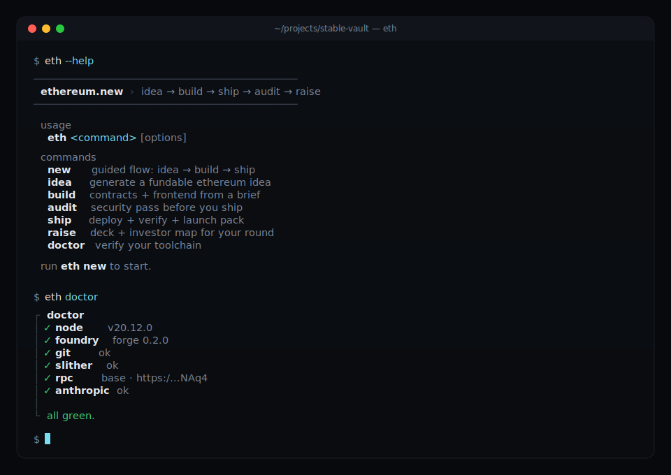

# ethereum.new

**idea → build → ship → audit → raise**

An AI-native CLI framework that takes a founder from raw idea to deployed Ethereum dApp in hours, not weeks. Chain-aware by default. Grounded in a bundled snapshot of [ethskills](https://github.com/ethskills/ethskills) — no runtime URL fetches, no hallucinated addresses. Opinionated so you don't have to be.

<p align="center">
  
</p>

```bash
curl -fsSL https://ethereum.new/setup.sh | bash
eth new
```

---

## table of contents

- [what it is](#what-it-is)
- [two ways to use](#two-ways-to-use)
- [goals](#goals)
- [design philosophy](#design-philosophy)
- [the five engines](#the-five-engines)
- [quick start](#quick-start)
- [how it works](#how-it-works)
- [project structure](#project-structure)
- [the grounding contract](#the-grounding-contract)
- [the reference template](#the-reference-template)
- [developer guide](#developer-guide)
- [roadmap](#roadmap)
- [contributing](#contributing)
- [telemetry](#telemetry)
- [credits](#credits)

---

## what it is

`ethereum.new` is the Ethereum answer to [solana.new](https://www.solana.new) — but sharper, deeper, and more opinionated. It's a single TypeScript CLI (`eth`) that orchestrates a crew of Claude-powered sub-agents through the five phases every founder hits on the way from a napkin sketch to a deployed, audited, funded product on Ethereum or one of its L2s.

The wedge is **grounding**. Every agent invocation loads the relevant ethskills markdown — **bundled locally in `./skills/`, never fetched at runtime** — into context *before* it writes a line of code. No hallucinated contract addresses. No stale gas costs. No generic "deploy on mainnet" advice when the use case obviously belongs on Base. What ships in the repo is what every agent sees.

## two ways to use

`eth` has two runtimes. Same skills, same grounding, different experience.

### path A: the CLI (requires `ANTHROPIC_API_KEY`)

```bash
export ANTHROPIC_API_KEY=sk-ant-...
eth idea
eth build
```

This is the full pipeline. You get orchestrated multi-agent workflows, phase handoff, template generation, chain recommendations, catalog search, deploy automation, and progress tracking. Each command chains multiple Claude agents automatically — `eth build` runs the architect, then the builder, in sequence.

### path B: Claude Code (no API key needed)

```bash
eth init
claude "/validate-idea Should I build a yield aggregator on Base?"
```

`eth init` installs all 31 skills into `~/.claude/skills/`. Claude Code handles its own auth via OAuth or subscriber login. You invoke skills as slash commands directly inside Claude Code or Codex.

### which should you use?

| | CLI (API key) | Claude Code (no key) |
|---|---|---|
| **Auth** | `ANTHROPIC_API_KEY` | Claude's own login |
| **Multi-agent orchestration** | One command → 4 agents chained | One prompt → one response |
| **Phase handoff** | Auto-accumulates context | Manual per-prompt |
| **Template + deploy** | Auto-copies, `forge script` wrapper | You run forge yourself |
| **Catalog search** | `eth search` across 193 entries | Not available |
| **Interactive TUI** | Progress lanes, structured prompts | Claude Code's own TUI |
| **Best for** | Shipping a full project end-to-end | Exploring ideas, learning, quick tasks |

**Recommendation:** Use the CLI for the full build pipeline. Use Claude Code for learning, idea exploration, and quick skill lookups. Both paths use the same 31 skill files — one source of truth.

## goals

1. **Compress time-to-ship from weeks to hours** without compromising safety or taste.
2. **Eliminate the classic AI-on-Ethereum failure modes**: hallucinated contract addresses, stale gas cost assumptions, infinite approvals, mocked-database tests that pass but break on migration, the agent that audits its own code.
3. **Be chain-aware, never generic.** The CLI should speak about *your* chain, *your* stack, *your* integrations — not "Ethereum" as a monolith.
4. **Ship one reference template that actually works end-to-end** (`templates/defi-vault/`) before cloning it to the other use cases, so every downstream template is measured against something real.
5. **Be self-describing.** A `SKILL.md` at the repo root lets any other AI agent discover `ethereum.new` and use it as a tool.

## design philosophy

Every surface of this tool reflects obsession with craft. These rules are non-negotiable:

- **CLI aesthetic** — monospace, minimal, Linear-grade attention to detail in a terminal.
- **Zero bloat** — opinionated defaults, no setup wizards, no 47-step tutorials. Override when you know better.
- **Speed is a feature** — real work only, no fake progress bars, no filler output.
- **Copy that cuts** — every prompt, label, and error message earns its place. No passive voice. No "please".
- **Chain-aware, never generic** — `eth` never defaults to mainnet just because mainnet is the default.
- **Grounded by ethskills** — no code without skill context loaded first. No exceptions.

## the five engines

```
eth new       guided flow: idea → build → ship
eth idea      generate a fundable ethereum idea
eth build     contracts + frontend from a brief
eth audit     security pass before you ship
eth ship      deploy + verify + launch pack
eth raise     deck + investor map for your round
```

Or just run `eth new` and answer one question.

### pre-build commands

```
eth beginner    learn ethereum fundamentals
eth validate    validate an idea before building
```

### quality commands

```
eth review      brutal product review
eth design      frontend design patterns for dapps
eth debug       debug failing contracts and tests
```

### launch commands

```
eth hackathon   prepare a hackathon submission
eth grant       apply for a grant program
```

### discovery commands

Beyond the five core engines, `eth` ships with discovery and quality-of-life commands:

```
eth search      search repos, skills, and mcp servers
eth repos       browse and clone ethereum repos by category
eth skills      list or show bundled skills
eth mcps        list or install mcp servers
eth copilot     freeform ethereum dev assistant
eth feedback    send feedback to the team
```

### ops commands

```
eth doctor      verify your toolchain
eth init        install skills into ~/.claude and ~/.codex
eth config      manage cli configuration
eth completion  generate shell completions
eth journey     interactive phase navigator (idea → raise)
eth telemetry   manage telemetry data
eth uninstall   remove skills and config
```

### 1. `eth idea`

Two modes:

- **curated** — ranks a corpus of 52 Ethereum-native ideas (growing to 500+) against your brief and has Claude flesh out the top match as a one-pager.
- **first-principles** — three sharp founder questions → non-obvious synthesis.

Output: `idea.md` (idea · why now · why Ethereum · who for · GTM · risks · first-24h plan).

### 2. `eth build`

The **architect** agent reads `ship`, `concepts`, `l2s`, `standards`, and `why` skills, decides contract count (1–3 for MVP), and recommends a chain. The **builder** agent reads `security`, `tools`, `addresses`, `standards`, `gas`, `testing`, and `building-blocks` skills, forks the chosen template, and adapts it to the brief — generating Solidity against OpenZeppelin with verified addresses only, Foundry unit + fuzz + fork tests, and a Scaffold-ETH 2 frontend using Scaffold hooks and the three-button flow.

### 3. `eth audit`

Runs as a **separate agent from the builder** (the ethskills `audit` skill explicitly warns that the agent that wrote the code should never audit its own code). Wraps Slither, walks the 500+ item checklist across 19 domains, emits `audit.md` with severity-ranked findings and a one-line remediation per finding. Runs *before* deploy in the default flow, not after.

### 4. `eth ship`

Pre-ship **reviewer** agent runs the QA checklist. Deploy wraps `forge script` with chain-aware RPC, verification, and multisig handoff guidance. Emits a launch pack: tweet, PH copy, Farcaster frame, investor one-liner.

### 5. `eth raise`

Competitive landscape mapped to your niche. Investor-grade seed deck. Smart-money map scoring 15 eth-native funds against your thesis (Paradigm, Variant, 1kx, Robot, Electric, Archetype, Placeholder, Bain Crypto, Dragonfly, Multicoin, a16z crypto, Coinbase Ventures, Framework, Hack VC, Pantera).

## quick start

```bash
# 1. install (idempotent; installs node check, foundry, eth global, writes config.toml)
curl -fsSL https://ethereum.new/setup.sh | bash

# 2. verify the toolchain
eth doctor

# 3a. CLI path — set your key
export ANTHROPIC_API_KEY=sk-ant-...
eth new

# 3b. Claude Code path — no key needed
eth init
claude "/find-next-crypto-idea What should I build on Ethereum?"
```

### local development (if you're hacking on the framework itself)

```bash
git clone https://github.com/yourname/ethereum.new.git
cd ethereum.new
npm install
npm run build            # tsup -> dist/index.js
node dist/index.js --help
node dist/index.js doctor
```

## how it works

```
┌──────────────┐    brief
│   eth new    │────────────────────────────┐
└──────────────┘                            ▼
                                    ┌───────────────┐
                                    │   router      │
                                    └──┬──┬──┬──┬──┬┘
                                       │  │  │  │  │
               ┌───────────┬───────────┘  │  │  │  └──────────┐
               ▼           ▼              ▼  ▼                ▼
         ┌─────────┐ ┌─────────┐   ┌─────────┐ ┌─────────┐ ┌─────────┐
         │  idea   │ │  build  │   │  audit  │ │  ship   │ │  raise  │
         └────┬────┘ └────┬────┘   └────┬────┘ └────┬────┘ └────┬────┘
              │           │              │           │           │
              ▼           ▼              ▼           ▼           ▼
         ┌───────────────────────────────────────────────────────────┐
         │           agents/runtime.ts  (single chokepoint)           │
         │  + loads bundled skills from ./skills/<phase>/<slug>/SKILL.md │
         │  + injects as system context before every Claude call     │
         │  + enforces: no hallucinated addresses, no secrets in writes│
         └───────────────────────────────────────────────────────────┘
                                   │
                                   ▼
                         ┌───────────────────┐
                         │  Claude Opus 4.6  │  architect/audit
                         │  Claude Sonnet    │  iterate
                         └───────────────────┘
```

## project structure

```
ethereum.new/
├── setup.sh                    curl installer
├── package.json                bin: eth → dist/index.js
├── tsconfig.json               strict TS, rootDir: cli
├── tsup.config.ts              ESM, node20, banner: #!/usr/bin/env node
├── SKILL.md                    self-describing for other AI agents
├── docs/
│   └── cli.svg                 terminal screenshot for the README
├── skills/                     bundled ethskills snapshot (31 SKILL.md files, MIT)
│   ├── SKILL_ROUTER.md         routing table for self-correcting skill switches
│   ├── idea/                   why · concepts · l2s · eth-beginner · validate-idea
│   ├── build/                  standards · security · tools · addresses · gas ·
│   │                           testing · building-blocks · frontend-ux ·
│   │                           frontend-playbook · wallets · orchestration ·
│   │                           indexing · noir · protocol · debug-contract ·
│   │                           design-taste · frontend-design-guidelines ·
│   │                           number-formatting · page-load-animations ·
│   │                           roast-my-product
│   ├── audit/                  audit · qa
│   ├── ship/                   ship
│   ├── launch/                 apply-grant · create-pitch-deck · submit-to-hackathon
│   └── README.md               attribution + refresh instructions
│   (each leaf is <phase>/<slug>/SKILL.md with name+description frontmatter)
├── cli/
│   ├── index.ts                dispatcher (26 commands registered)
│   ├── telemetry.ts            local JSONL logging + rotation
│   ├── ui/
│   │   ├── theme.ts            palette + glyphs
│   │   ├── banner.ts           wordmark
│   │   ├── prompt.ts           @clack/prompts wrapper (one voice)
│   │   └── stream.ts           multi-lane agent status view
│   ├── commands/
│   │   ├── new.ts              "what are you building?" REPL entry
│   │   ├── idea.ts
│   │   ├── build.ts
│   │   ├── audit.ts
│   │   ├── ship.ts
│   │   ├── raise.ts
│   │   ├── doctor.ts
│   │   ├── init.ts             install skills into ~/.claude and ~/.codex
│   │   ├── search.ts           search repos, skills, mcps
│   │   ├── repos.ts            browse and clone ethereum repos
│   │   ├── skills.ts           list or show bundled skills
│   │   ├── mcps.ts             list or install mcp servers
│   │   ├── copilot.ts          freeform ethereum dev assistant
│   │   ├── feedback.ts         send feedback to the team
│   │   ├── telemetry.ts        manage telemetry data
│   │   ├── uninstall.ts        remove skills and config
│   │   ├── completion.ts       generate shell completions
│   │   ├── config.ts           manage cli configuration
│   │   ├── journey.ts          interactive phase navigator
│   │   ├── beginner.ts         learn ethereum fundamentals
│   │   ├── validate.ts         validate an idea before building
│   │   ├── review.ts           brutal product review
│   │   ├── design.ts           frontend design patterns for dapps
│   │   ├── debug.ts            debug failing contracts and tests
│   │   ├── hackathon.ts        prepare a hackathon submission
│   │   └── grant.ts            apply for a grant program
│   ├── agents/
│   │   ├── runtime.ts          the single Claude chokepoint
│   │   ├── architect.ts        Opus 4.6 · returns a Plan JSON
│   │   ├── builder.ts          Sonnet · forks template, edits files
│   │   ├── auditor.ts          Opus 4.6 · slither + checklist
│   │   ├── reviewer.ts         Opus 4.6 · pre-ship QA, separate agent
│   │   └── raise.ts            deck + investors + landscape
│   ├── skills/
│   │   ├── registry.ts         task → skill slug routing table
│   │   └── loader.ts           walks skills/<phase>/<slug>/SKILL.md, memoised
│   ├── chains/
│   │   ├── registry.ts         mainnet · base · arbitrum · op · zksync
│   │   └── recommend.ts        heuristic use-case → chain hint
│   ├── data/
│   │   ├── clonable-repos.json  curated repo catalog (88 entries)
│   │   ├── eth-mcps.json        mcp server catalog (29 entries)
│   │   ├── eth-skills.json      skill metadata catalog (76 entries)
│   │   ├── loader.ts            JSON data loader with caching
│   │   └── types.ts             Repo, SkillEntry, Mcp type definitions
│   ├── handoff/
│   │   ├── context.ts           phase context read/write between commands
│   │   └── types.ts             HandoffContext type definitions
│   ├── ideas/
│   │   ├── corpus.json         52 tagged ideas (seed)
│   │   └── engine.ts           curated + first-principles modes
│   ├── templates/
│   │   └── copy.ts             copyTemplate(name, { chain }) → ./<slug>
│   ├── deploy/
│   │   └── deploy.ts           chain-aware forge script wrapper
│   └── util/
│       ├── args.ts             dependency-free arg parser
│       ├── env.ts              ~/.ethereum.new/config.toml + scanForSecrets
│       ├── exec.ts             spawn wrapper + which()
│       ├── fs.ts               writeProjectFile (runs secret scanner)
│       ├── output.ts           --agent flag support + emit() pattern
│       └── update-check.ts     version nudge on command completion
└── templates/
    └── defi-vault/             reference template (see below)
        ├── foundry.toml
        ├── remappings.txt
        ├── src/StableVault.sol
        ├── test/StableVault.t.sol
        ├── script/Deploy.s.sol
        ├── frontend/app/page.tsx
        ├── frontend/README.md
        └── README.md
```

## the grounding contract

Every call to Claude passes through `cli/agents/runtime.ts`, which:

1. Looks up the task in `cli/skills/registry.ts`.
2. Reads the markdown directly from `./skills/<phase>/<slug>/SKILL.md` on disk — bundled with the repo, **never fetched**.
3. Injects the skills as system context ahead of the task-specific prompt.
4. Enforces three hard rules: no hallucinated addresses, live gas checks (`cast base-fee`), no secrets in diffs.

Task → skill routing table:

| task                  | skills                                                          |
| --------------------- | --------------------------------------------------------------- |
| `architect`           | ship, concepts, l2s, standards, why                             |
| `build.contracts`     | security, tools, addresses, standards, gas, testing, building-blocks |
| `build.frontend`      | frontend-ux, frontend-playbook, wallets, orchestration          |
| `build.review`        | roast-my-product, design-taste, frontend-ux                     |
| `build.debug`         | debug-contract, tools, testing                                  |
| `build.frontend.design` | frontend-design-guidelines, frontend-ux, design-taste         |
| `audit`               | audit, security                                                 |
| `ship`                | qa, ship, l2s                                                   |
| `idea`                | why, concepts, l2s                                              |
| `idea.validate`       | validate-idea, why, concepts                                    |
| `idea.beginner`       | eth-beginner, concepts, l2s                                     |
| `launch.deck`         | create-pitch-deck, why                                          |
| `launch.hackathon`    | submit-to-hackathon, ship                                       |
| `launch.grant`        | apply-grant, why                                                |

Miss any of these and you're not grounding — you're guessing.

## the reference template

`templates/defi-vault/` is the template every other `eth build` output is measured against. Read it before you clone it.

- **`src/StableVault.sol`** — ERC-4626 vault with deposit cap, pause, reentrancy guard, and a **48h timelocked strategy rotation**. Invariant: `totalAssets() == underlying.balanceOf(vault) + reportedStrategyBalance`.
- **`test/StableVault.t.sol`** — unit + fuzz tests. Covers deposit/withdraw roundtrip, cap enforcement, timelock, pause, and share accounting invariant under fuzzed deposits.
- **`script/Deploy.s.sol`** — chain-agnostic deploy driven by env (`VAULT_ASSET`, `VAULT_CAP`, `VAULT_OWNER`, …).
- **`frontend/app/page.tsx`** — Scaffold-ETH 2 page implementing the **three-button flow** (switch network → approve → deposit), exact allowances only (`parseUnits(amount, 6)` — never `type(uint256).max`), human-readable display via `formatUnits`.

Run it locally:

```bash
cd templates/defi-vault
forge install foundry-rs/forge-std OpenZeppelin/openzeppelin-contracts
forge test
```

## developer guide

### prerequisites

- Node ≥ 20
- Foundry (install via `foundryup`)
- Slither — optional, recommended (`pip install slither-analyzer`)
- `ANTHROPIC_API_KEY` — without one, agents degrade to informative stubs so you can still see the shape of the flow

### day-one workflow

```bash
git clone https://github.com/yourname/ethereum.new.git
cd ethereum.new
npm install
npx tsc --noEmit         # typecheck
npm run build            # tsup bundle → dist/index.js
node dist/index.js --help
node dist/index.js doctor
```

### add a new command

1. Create `cli/commands/<name>.ts` exporting `async function cmd<Name>(argv: string[])`.
2. Register it in `cli/index.ts` under the `commands` map with a ≤ 50-char summary.
3. If it needs an agent, reuse `invoke()` from `cli/agents/runtime.ts` — don't call the Anthropic SDK directly.
4. Every user-visible string lives in `cli/ui/prompt.ts` helpers (`intro`, `step`, `done`, `fail`, `outro`, `note`). Never `console.log` raw.
5. File writes go through `cli/util/fs.ts::writeProjectFile` so the secret scanner runs.

### add a new chain

Edit `cli/chains/registry.ts`:

```ts
export type ChainId = "mainnet" | "base" | ... | "yournewchain";

CHAINS.yournewchain = {
  id: "yournewchain",
  name: "Your New Chain",
  chainId: 1337,
  rpcEnv: "YOURNEWCHAIN_RPC",
  rpcDefault: "https://...",
  explorer: "https://...",
  currency: "ETH",
  superpower: "what makes this chain non-generic — one line",
  testnet: { name, chainId, rpcDefault, explorer, faucet },
};
```

Then add relevance rules to `cli/chains/recommend.ts` — your chain must answer "what use cases unambiguously belong here?"

### add a new skill from ethskills

1. Create the directory under the appropriate phase:
   ```bash
   mkdir -p skills/<phase>/<slug>
   curl -sSf -o skills/<phase>/<slug>/SKILL.md https://ethskills.com/<slug>/SKILL.md
   ```
   Phases: `idea`, `build`, `audit`, `ship`, `launch`.
2. Add `<slug>` to the `SkillSlug` union in `cli/skills/registry.ts`.
3. Add it to the skills list for any task that needs it.
4. Keep the cost in mind — every skill added to a task inflates that agent's context.

### add a new template

1. `mkdir templates/<name>` and mirror the structure of `defi-vault/`: `src/`, `test/`, `script/`, `frontend/`.
2. Include a `README.md` explaining the security model and invariants.
3. Add the template name to the `template` union in `cli/agents/architect.ts` (the `Plan` interface).
4. Run `eth build --brief "..."` to confirm the architect picks it for relevant briefs.

### add a new agent

1. `cli/agents/<role>.ts` exports an `async function run<Role>(input): Promise<Output>`.
2. It calls `invoke({ task, tier, system, prompt })` — never the SDK directly.
3. If it audits or reviews other agents' output, it **must** use a different model run — the ethskills audit skill requires fresh eyes.
4. Wire it into whichever command needs it.

### tests

This repo is young — no JS test suite yet. For now, quality gates are:

- `npx tsc --noEmit` must pass (strict TS with `noUncheckedIndexedAccess`)
- `npm run build` must produce `dist/index.js` cleanly
- `node dist/index.js doctor` must render without crashing
- `cd templates/defi-vault && forge test` must be green after installing deps

A proper vitest suite is on the roadmap. See [roadmap](#roadmap).

### coding style

- **TypeScript strict mode**, ESM-only, node 20+.
- **Comment rules**: default to no comments. Only write a comment when the *why* is non-obvious — a hidden constraint, a subtle invariant, a workaround.
- **No emojis** in code, output, or docs.
- **Error copy** is one short sentence with what to do next: `"foundry not installed. run \`foundryup\`."`
- **Dependencies are expensive** — think twice before adding one. Current core deps: `@anthropic-ai/sdk`, `@clack/prompts`, `picocolors`. That's it.

## roadmap

**v0.1 (done)** — CLI skeleton, five engines wired, defi-vault reference template, bundled skills snapshot.

**v0.2 (done)** — discovery layer: `eth search`, `eth repos` (88 curated repos across 8 categories), `eth skills` catalog (76 skills), `eth mcps` server directory (29 MCPs), `eth copilot` freeform assistant, `eth feedback` command.

**v0.3 (done)** — phase handoff system (`cli/handoff/`) for passing context between commands, local telemetry with JSONL logging and rotation, `eth uninstall`, `eth doctor` toolchain verification, `eth init` skill installer, `eth config` CLI config manager, `eth completion` shell completions, `eth journey` interactive TUI navigator. 7 new launch commands: `eth beginner`, `eth validate`, `eth review`, `eth design`, `eth debug`, `eth hackathon`, `eth grant`. All 14 task keys now invoked — zero dead routing entries.

**v0.4** — fill in the remaining five templates:
- `nft-drop/` — ERC-721A with allowlist signing and the Farcaster frame flow
- `dao-governance/` — OpenZeppelin Governor + Tally integration
- `agent-wallet/` — ERC-4337 smart account with session keys
- `rwa-issuance/` — permissioned T-bill vault with allowlist NFTs
- `zk-privacy/` — Noir circuit + on-chain verifier + shielded payroll UI

**v0.5** — proper vitest suite, e2e smoke test that runs `eth new → idea → build → audit` against a stub Anthropic server and diff-checks the output.

**v0.6** — grow the idea corpus from 52 to 500, add `eth ideas refresh` to pull from YC, Alliance, Superteam, SendAI.

**v0.7** — `eth skills refresh` command that pulls newer versions of the bundled ethskills files from upstream and shows a diff.

**v0.8** — landing page at ethereum.new (Next.js) that mirrors the CLI's taste — only after the CLI earns it.

**v0.9** — `@ethereum.new/sdk` — programmatic access so other tools can call the engines without going through the CLI.

## contributing

Open a PR. Keep changes tight. Match the existing voice. If you're adding a template or a chain, read the [developer guide](#developer-guide) first.

## telemetry

Telemetry is local-only by default — no data leaves your machine. Each command appends one line to `~/.ethereum.new/telemetry.jsonl` containing: command name, truncated args hash, exit code, duration, version, timestamp. No source code, secrets, file paths, or brief text is ever recorded.

Disable: `ETH_TELEMETRY=0 eth doctor` or `eth telemetry disable`. Clear: `eth telemetry clear`. Under `--agent` mode telemetry is always suppressed.

## credits

Inspired by [solana.new](https://www.solana.new).
Grounded on a bundled snapshot of [ethskills](https://github.com/ethskills/ethskills) (MIT) — see `skills/README.md`.
Agent runtime built on [Claude](https://www.anthropic.com) (Opus 4.6 + Sonnet).

Built by people who think taste is a feature.

## license

MIT.
